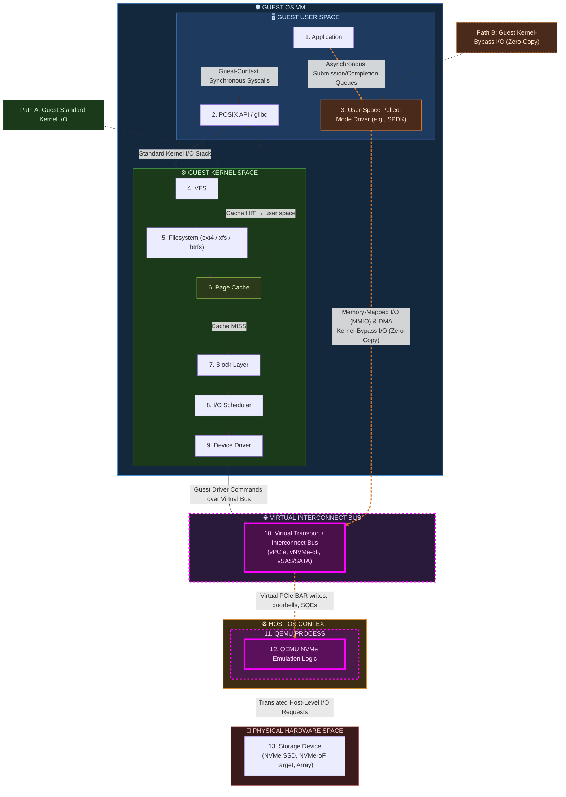

# Linux Block I/O Stack

> **Note:** Mermaid does not support collapsible nodes. The diagram below shows the compact flow; expand each `▶ Details` section beneath it for per-layer descriptions.

---

<strong>1. Application</strong> — User Space

Your program logic that processes data and initiates I/O requests (e.g. a database engine, web server, or CLI tool).

<strong>2. POSIX API / C Standard Library (glibc)</strong> — User Space

Provides standard I/O wrappers: `read()`, `write()`, `pread()`, `mmap()`. Handles the transition from user space into the kernel via system call traps.

<strong>3. User-Space Polled-Mode Driver (e.g., SPDK)</strong> — User Space

Implements the guest VM's asynchronous queue-driven path. Requests are issued through submission/completion queues in guest user space and then sent over the guest virtual interconnect to a single emulation point.

<strong>4. VFS — Virtual File System</strong> — Kernel Space

Presents a unified file interface to the layers above, regardless of the underlying filesystem. Routes each request to the correct concrete filesystem implementation.

<strong>5. Filesystem (ext4 / xfs / btrfs)</strong> — Kernel Space

Translates logical file offsets (byte ranges inside a file) into physical block addresses on the device. Manages filesystem metadata: inodes, directory entries, extents, journals.

<strong>6. Page Cache</strong> — Kernel Space

Caches file data in RAM to avoid redundant disk access.

- **Cache HIT** — data is already in RAM; returned directly to user space without touching the block layer.
- **Cache MISS** — data is not cached; execution continues down to the Block Layer to fetch it from storage.

<strong>7. Block Layer</strong> — Kernel Space

Constructs `bio` (block I/O) structures representing the read/write operation. Merges adjacent or overlapping requests (request merging) and queues them for the I/O scheduler.

<strong>8. I/O Scheduler</strong> — Kernel Space

Reorders queued block requests to optimize throughput and latency. Common schedulers:

| Scheduler | Best for |
|-----------|----------|
| `mq-deadline` | latency-sensitive (databases, VMs) |
| `bfq` | interactive desktops, fairness |
| `none` | NVMe SSDs (already fast, no reorder needed) |

<strong>9. Device Driver</strong> — Kernel Space

Translates kernel-level block I/O requests into hardware-specific command protocols. Examples: NVMe driver (NVMe command set over PCIe), SCSI driver (SCSI CDBs over SAS/SATA via libata).

<strong>10. Virtual Transport / Interconnect Bus (vPCIe, vNVMe-oF, vSAS/SATA)</strong> — Guest/Host Boundary

Convergence point for both guest paths. Whether requests originate from guest-context synchronous system calls through the guest kernel stack or from guest asynchronous queue submission, both flows enter this same virtual bus and are forwarded to QEMU emulation.

<strong>11. QEMU Process</strong> — Host OS Context

Host-side userspace process that terminates the guest virtual device model. It receives guest device interactions from the virtual bus and coordinates emulation, memory translation, and request submission toward host-accessible storage resources.

<strong>12. QEMU NVMe Emulation Logic</strong> — Host OS Context

Processes guest NVMe protocol operations arriving over virtual PCIe semantics, including guest BAR writes, doorbell updates, and submission queue entries. The emulator translates guest memory pointers into host memory addresses, interprets command structures, and emits corresponding host-level I/O requests to reach real storage.

<strong>13. Storage Device (NVMe SSD, NVMe-oF Target, Array)</strong> — Hardware Space

The physical endpoint that executes I/O operations, including local NVMe SSDs, remote NVMe-oF targets, and storage arrays.

