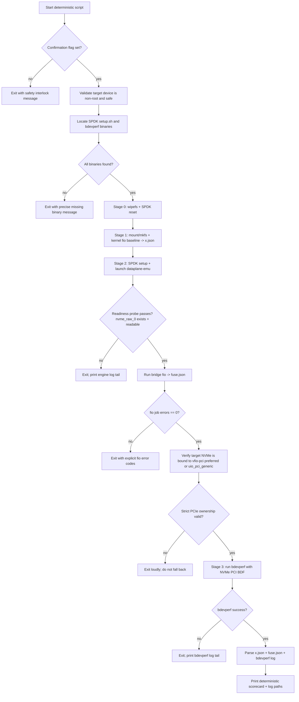

# Architect Brief: Deterministic ARM64 Storage Demo

## Objective
Deliver a reproducible, operator-friendly benchmark flow for Azure Cobalt/AWS Graviton that:
- avoids hidden terminal behavior (no tmux, no alternate buffers),
- enforces strict readiness probes before benchmark stages,
- uses real SPDK Stage 3 metrics via `bdevperf` with strict PCIe-only device ownership (no synthetic bypass math and no kernel-backed fallback).

## What Changed
1. Added deterministic launcher: `launch_arm_neoverse_demo_deterministic.sh`
- Foreground execution only.
- Strict safety gate (`ARM_NEOVERSE_DEMO_CONFIRM=YES`) and root-disk protection.
- Explicit stage logs and fail-fast behavior.

2. Stage 3 now uses real SPDK benchmark
- Replaced synthetic formulas with live `bdevperf` run over PCIe NVMe.
- Produces measured Stage 3 IOPS/latency from SPDK path.
- If `bdevperf` is missing, launcher attempts auto-build (default enabled) and logs to `/tmp/arm_neoverse_bdevperf_build.log`.
- If the NVMe device cannot be rebound from the kernel driver to a user-space PCI driver, Stage 3 fails fast by design.

3. Strict readiness probes
- Stage 2 bridge benchmark starts only after `/tmp/arm_neoverse/nvme_raw_0` exists and is readable via direct `dd` probe.
- Any probe failure aborts with engine log tail.

## Final Control Flow


## Stage Definitions
1. Stage 0 (sanitize/reset)
- `wipefs -a` on data disk.
- `setup.sh reset` to clear SPDK binding state.

2. Stage 1 (kernel baseline)
- Filesystem mount path benchmark via fio randrw 4k, QD=128, runtime=30s.
- Output: `x.json`.

3. Stage 2 (user-space bridge)
- Start `dataplane-emu` in foreground-managed background process.
- Wait for strict bridge readiness probe.
- fio against `nvme_raw_0` through bridge.
- Output: `fuse.json`.

4. Stage 3 (real zero-copy path)
- Generate temporary SPDK bdev JSON for target PCI BDF.
- Confirm the target PCI function is owned by `vfio-pci` (preferred) or `uio_pci_generic`, not the kernel `nvme` driver.
- Run `bdevperf` with same QD/runtime class.
- Output: `/tmp/arm_neoverse_bdevperf.log`.

## Determinism and Failure Semantics
- No stage continues after upstream failure.
- No stale JSON reuse (`: > x.json`, `: > fuse.json`).
- All failures emit actionable context from stage logs.
- No kernel-backed fallback path is allowed for Stage 3.
- Cleanup trap removes mounts/processes on exit.

## Runbook
1. Prereqs
- `./build/dataplane-emu` built.
- SPDK setup script available (`./spdk/scripts/setup.sh` preferred).
- `bdevperf` binary available, or allow auto-build fallback (`DEMO_AUTOBUILD_BDEVPERF=1`, default).

Manual one-command bdevperf build (if you prefer explicit build):
```bash
cd spdk && make -j"$(nproc)" bdevperf || make -j"$(nproc)" app/bdevperf || make -j"$(nproc)"
```

2. Execute
```bash
export ARM_NEOVERSE_DEMO_CONFIRM=YES
./launch_arm_neoverse_demo_deterministic.sh
```

3. Optional overrides
```bash
DEMO_NVME_DEVICE=/dev/nvme0n1 \
DEMO_RUNTIME_SEC=30 \
DEMO_IODEPTH=128 \
DEMO_AUTOBUILD_BDEVPERF=1 \
DEMO_BDEVPERF_BIN=/absolute/path/to/bdevperf \
ARM_NEOVERSE_DEMO_CONFIRM=YES \
./launch_arm_neoverse_demo_deterministic.sh
```

## Key Log Files
- `/tmp/arm_neoverse_base.log`
- `/tmp/arm_neoverse_fuse.log`
- `/tmp/arm_neoverse_spdk_setup.log`
- `/tmp/arm_neoverse_bdevperf.log`
- `/tmp/arm_neoverse_engine.log`
- `/tmp/arm_neoverse_bdevperf_build.log` (only when auto-build path is used)

## Architect Notes
- Current Stage 3 parser extracts terminal IOPS/latency tokens from `bdevperf` output; if your SPDK build format differs, align parser regexes with your exact output.
- For production demo hardening, consider pinning CPU cores for `dataplane-emu` and `bdevperf` and collecting percentile latency (p95/p99) per stage.
