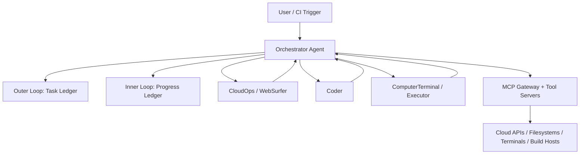
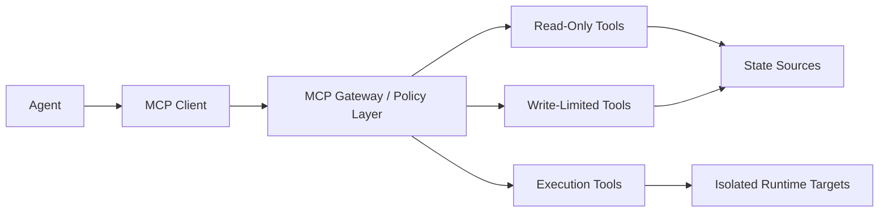
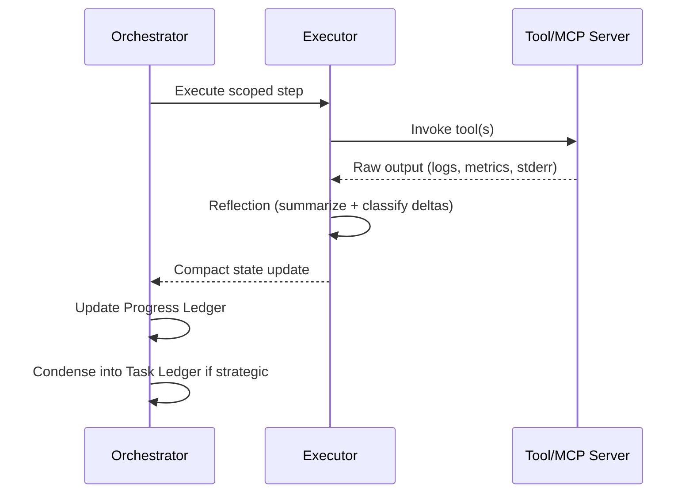

# Tensorplane Multi-Agent Architecture (Industrial-Grade)

This document defines the production architecture for the Tensorplane AI Foundry and `dataplane-emu` Multi-Agent System (MAS). The design goal is explicit: prevent unsafe autonomous execution while increasing delivery reliability, auditability, and throughput for infrastructure-heavy workflows.

The architecture replaces single-agent, "do-everything" execution with a governed Mixture of Experts coordinated by a central Orchestrator and bounded by the Model Context Protocol (MCP).

## 1) Orchestration Layer (Magentic-One Pattern)

### Why Orchestration Is Mandatory

A single autonomous coding agent with direct execution power is a systemic safety risk. In prior operation, non-orchestrated execution paths allowed a script to run without policy-aware review and damaged host-level resources. The remediation is architectural, not procedural: execution authority is removed from general-purpose agents and centralized in an Orchestrator.

### Control Topology

The Orchestrator is the only planning authority. Specialist agents do not self-initiate workflows; they execute scoped assignments and return structured outcomes.

### Dual-Loop Execution Model

The Orchestrator operates two ledgers simultaneously.

| Loop | Ledger | Purpose | Persistence | Owner |
|---|---|---|---|---|
| Outer Loop | Task Ledger | Maintains high-level mission state: facts, assumptions, risks, constraints, and the execution plan | Long-lived across the full task | Orchestrator |
| Inner Loop | Progress Ledger | Tracks step-level actions, tool outputs, reflections, handoffs, retries, and current blockers | Short-cycle, updated each step | Orchestrator |

#### Outer Loop (Task Ledger)

The Task Ledger captures:
- Confirmed facts (for example, branch state, deployed environment, policy constraints).
- Guesses/hypotheses explicitly labeled as unverified.
- Plan decomposition: milestones, dependencies, and acceptance criteria.
- Risk register and mitigation path.

This ledger prevents strategic drift and acts as the authoritative "why" and "what" for the system.

#### Inner Loop (Progress Ledger)

The Progress Ledger captures:
- Step intent and assigned specialist.
- Tool invocation summary (not raw output dumps).
- Reflection result: what changed, what failed, confidence level.
- Next decision: continue, branch, retry, escalate, or halt.

A stall counter is maintained in the inner loop to detect unproductive cycles.

| Stall Signal | Detection Rule | Orchestrator Action |
|---|---|---|
| Repeated no-op outcomes | N consecutive steps produce no state change | Replan with different specialist/tool path |
| Repeated tool failure | Same failure class repeats above threshold | Escalate constraints, tighten scope, request human approval |
| Oscillation | System alternates between incompatible subplans | Freeze branch, checkpoint ledger, choose single path |

## 2) Mixture of Experts (Specialist Agents)

### Principle

Isolated "do-it-all" coding agents are a liability in production systems. Tensorplane uses role-specialized agents with strict tool boundaries and narrow responsibilities.

### Expert Definitions

| Specialist | Scope | Allowed Tool Class | Forbidden Behavior |
|---|---|---|---|
| CloudOps / WebSurfer | Gather cloud and web infrastructure context (accounts, regions, quotas, service status, docs) | Read-focused cloud/web tools, metadata queries, console navigation adapters | Direct code mutation or privileged shell execution |
| Coder | Produce and analyze C++/Rust dataplane code and deployment scripts | Repository read/write tools, static analysis, build graph reasoning | Direct runtime execution against host infrastructure |
| ComputerTerminal / Executor | Execute compiled binaries and shell scripts in controlled runtime environments | Restricted terminal and runner tools, artifact execution, benchmark harnesses | Source-authoring decisions or broad repo refactors |

### Separation of Duties

The Orchestrator enforces that code generation and code execution are distinct security domains:
- Coder writes and reasons about source.
- Executor runs artifacts in an isolated shell boundary.
- Orchestrator validates handoff contracts between both.

This split reduces blast radius and makes failures attributable, reproducible, and auditable.

## 3) Model Context Protocol (MCP) as the Security Boundary

MCP is the control plane for agent-to-system interaction. Agents do not receive implicit API trust, ad-hoc credentials, or unrestricted terminal access.

### Why MCP

MCP provides:
- Standardized tool discovery and invocation contracts.
- Explicit capability boundaries per agent role.
- Controlled read/write exposure of resources.
- Audit-friendly invocation streams for governance and forensics.

### Security Controls Enforced Through MCP

| Control | Mechanism | Outcome |
|---|---|---|
| Least privilege | Per-agent allowlists and explicit tool grants | Agents cannot invoke out-of-scope capabilities |
| Read/write separation | Distinct tool surfaces for observation vs mutation | Reduced accidental destructive actions |
| Execution isolation | Executor-only access to runtime tools | Prevents coder-side arbitrary host execution |
| Policy gates | Approval hooks for sensitive operations | Human oversight for high-impact actions |
| Full traceability | Structured request/response records | Post-incident forensic reconstruction |

This model allows bare-metal and high-performance execution tools to remain available while materially lowering systemic failure risk.

## 4) Context Optimization and Memory Consolidation

Long-running infrastructure tasks can exceed practical context windows if raw tool output is continuously appended. Tensorplane treats context as a managed resource.

### Reflection-First Output Handling

Execution specialists must not stream full shell logs, compiler dumps, or benchmark output into global context by default. Instead, each execution step performs an active Reflection phase.

Reflection output must include:
- What changed (state delta).
- What failed (error class + likely cause).
- What evidence matters (minimal excerpts, identifiers, metrics).
- Recommended next action.

### Ledger-Driven Consolidation

Only reflected summaries are promoted into the Progress Ledger, then distilled into the Task Ledger when strategically relevant.

### Practical Benefits

- Prevents context window bloat on multi-hour workflows.
- Improves reasoning quality by elevating signal over noise.
- Reduces token cost without losing operational fidelity.
- Preserves a deterministic audit trail through ledger checkpoints.

## Architectural Invariants

The following invariants are non-negotiable for production runs:
- The Orchestrator is the only agent that owns global plan state.
- Specialists are role-scoped and capability-bounded.
- MCP is the mandatory security boundary for tool execution.
- Execution and code authoring remain separated by design.
- Raw output is reflected before entering shared context.

These invariants are the foundation of Tensorplane's transition from ad-hoc agent automation to industrial-grade agentic systems engineering.

## 5. Tensorplane Operational Axioms

The following axioms were derived from production incident response — specifically, a host OS crash caused by a monolithic coding agent that unbound the NVMe root drive during an SPDK deployment on AWS Graviton. They are non-negotiable design laws for every agent workflow in the Tensorplane AI Foundry.

- **P1 — Capability Scope = Blast Radius:** An agent's ability to cause irreversible damage is directly proportional to how many tool categories it can access simultaneously. Code generation and host execution must never be held by the same agent.

- **P2 — Prompt Quality Is Not a Safety Control:** No matter how carefully you word an instruction, a single-agent system has no architectural barrier between reasoning and destruction. Safety must be enforced at the system layer, not the prompt layer.

- **P3 — The Orchestrator Must Own Context; Specialists Must Own Execution:** A specialist agent (Coder, CloudOps, Executor) has deep capability in one domain but no situational awareness of the full environment. The Orchestrator's sole job is to hold that global context and make delegation decisions — it must never execute directly.

- **P4 — Self-Healing Requires Separation of Concerns by Design:** Recovery only became possible because distinct specialist agents (WebSurfer for AWS console, Orchestrator for replanning, Coder for script rewrite) could operate independently. A monolithic agent cannot recover from its own failure.

These axioms are formally recorded in [ADR 001](adr/001-mcp-mixture-of-experts.md) and govern all Tensorplane agent deployments.
